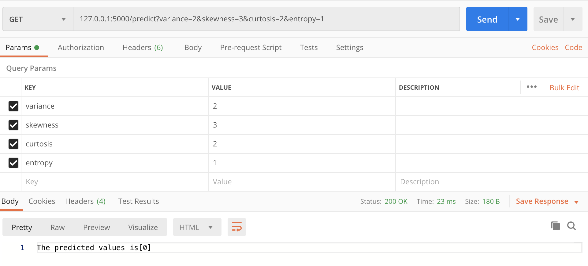
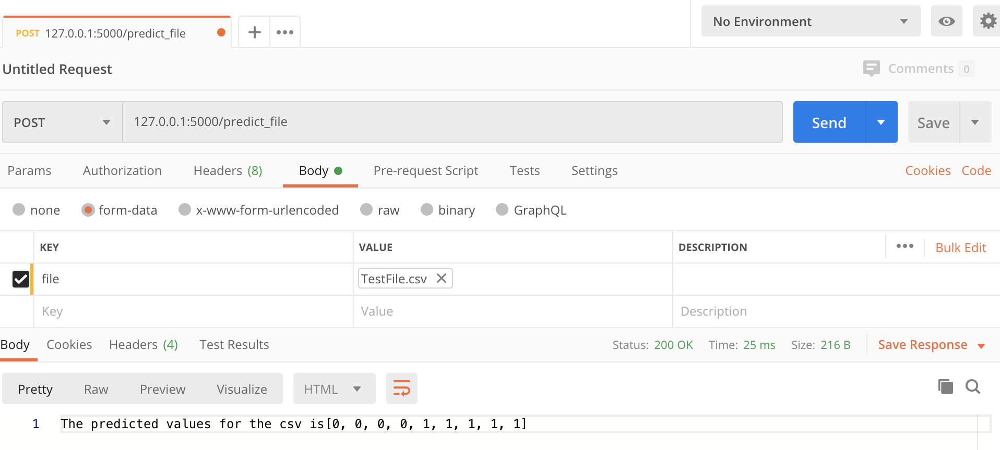
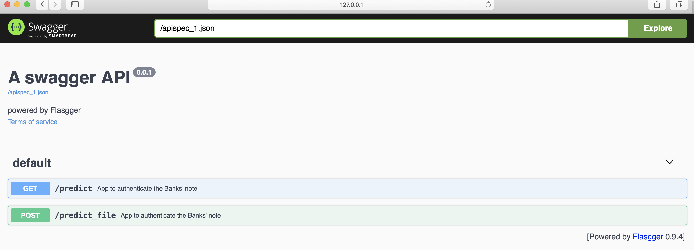
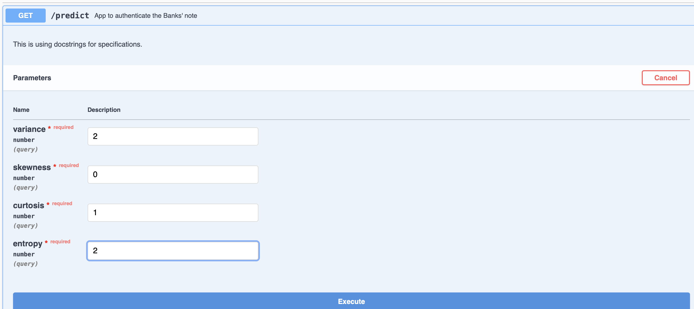
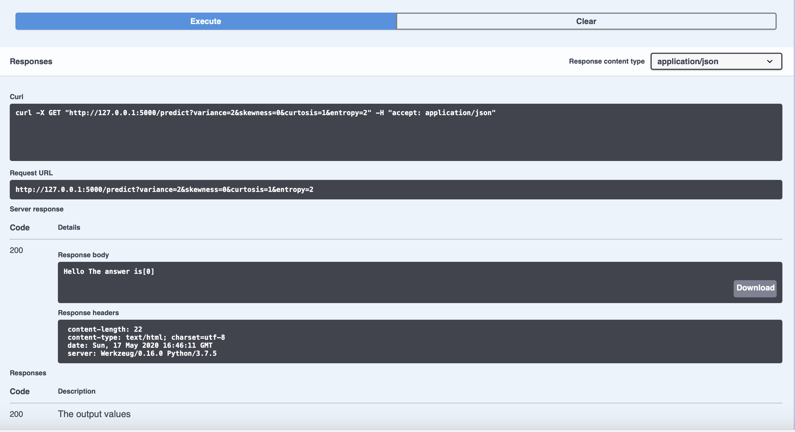
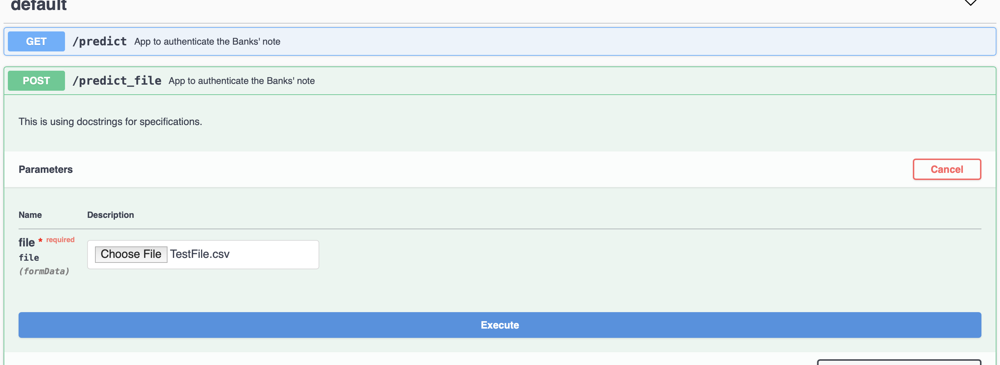
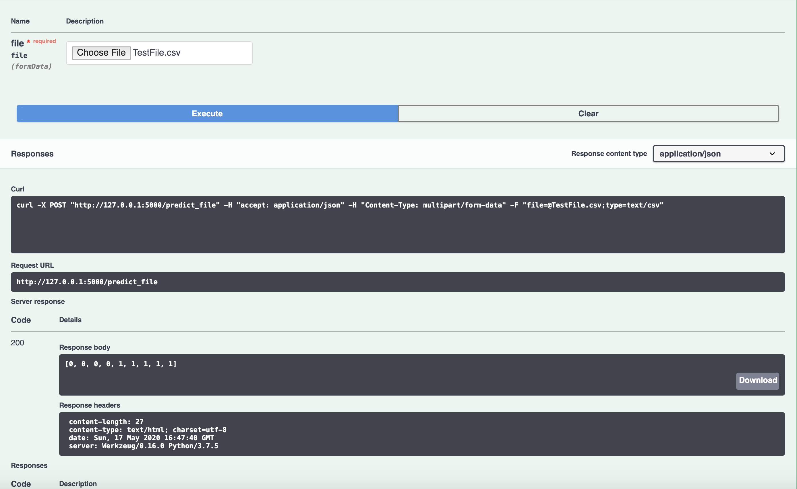

# BankNote_Authentication_AWS_ECS
Implementation of an end-end ML project and deployment using aws

# For testing API using postman

query : ttp://127.0.0.1:5000/predict?variance=2&skewness=3&curtosis=2&entropy=1  
result : Either 0 for non-authentic and 1 for authentic banknote

# Modules

pip3 install -r requirements.txt  

(pandas, Flask,request, sklearn , numpy,pickle)

# Results

### Output from query

### Output from loaded test file

# For front end testing using swagger

Use this command:  
http://127.0.0.1:5000/apidocs/

# Results

### For GET Method

### For POST method

